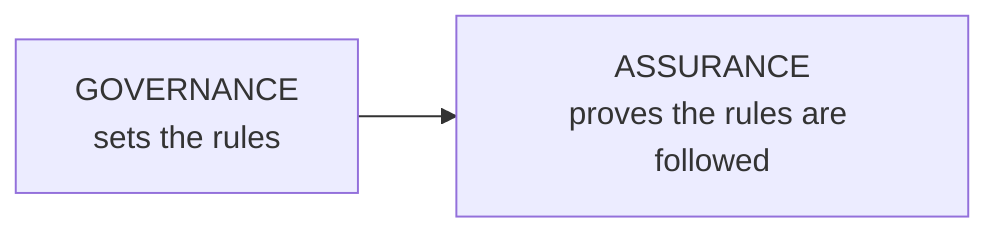

# NMIS-CATP-07810-AI-Assurance-Workbench-WP5

A reusable framework for generating standards-mapped evidence of AI trustworthiness for machine vision models deployed in manufacturing, covering both AI model assurance and data assurance. Builds on the Bolt Detection Model case study (WS5) to generalize testing across the EU AI Act, NIST AI RMF, and ISO/IEC AI standards.

## Governance and Assurance

AI systems are increasingly deployed in manufacturing and other safety-critical settings well before anyone outside the development team has systematically verified how they behave. A model performs well in testing, moves to production, and from that point on, trust in it rests on the original team's word rather than ongoing proof. This is the exact gap regulators, auditors, and the EU AI Act are pushing back against.

**A claim is not evidence.**

"Our AI system is safe, fair, and transparent" is a claim.

"Here is the adversarial robustness test from this date showing 100% resistance to noise attacks. Here is the DeepChecks report. Here are the SHAP saliency maps confirming legitimate features." is evidence.

Regulators, auditors, and clients only accept the second kind of statement.

- **Governance**: the policies, sign-off procedures, named responsible persons, and audit schedules that exist before and around testing.
- **Assurance**: the test results, saliency maps, robustness scores, and documentation that prove the rules are followed.

## What We Achieved in Phase 1

Phase 1 tested a real, already-deployed computer vision model, the Bolt Detection Model, an assembly and defect-detection system checking bolts on a production line. Built on EfficientDet and deployed on an NVIDIA Jetson Nano at the inspection point, it was a joint effort between Thales and NMIS, with MTC acting as the validation body and Innovate UK as the funding context.

**Governance in Phase 1:**

- Thales and NMIS chose EfficientDet, scoped to real-time edge deployment on an NVIDIA Jetson Nano
- MTC's five-pillar framework was selected over alternatives like NIST AI RMF or ISO 42001, a governance act with consequences Phase 2 revisits directly
- mAP@0.5 was set as the primary benchmark, with defined thresholds for excellent, good, concerning, and critical
- Stated purpose: ensure reliable, trustworthy performance in real-world manufacturing environments where assembly errors could have significant safety and operational consequences
- Named stakeholders: NMIS and Thales, MTC as validation body, Innovate UK as funder

**Assurance in Phase 1:**

| Pillar | Tool | Evidence | Score |
|---|---|---|---|
| Transparency & Explainability | SHAP | SHAP values >0.65 correlate with actual bolt positions, evidence against spurious correlation | 100% |
| Safety, Security & Robustness | ART | FGSM/PGD/C&W/noise/patch attacks at ε = 0.01, 0.03, 0.05. 100% robust to noise; 66.7% accuracy drop under C&W | 71% |
| Fairness | DeepChecks | 83% drop in bright lighting, 98% drop in normal sharpness | 55% |
| Accountability | Model Card Toolkit | mAP@0.5 = 81.9%, mAP@0.75 = 59.7%, documented limitations | 90% |

## What We Plan to Do in Phase 2

Phase 1 proved this approach works, by hand, for one model. Phase 2 turns it into a reusable schema, so the same evidence trail can be generated for any model, regardless of architecture.

*Full breakdown in a separate doc within this repo, next.*
