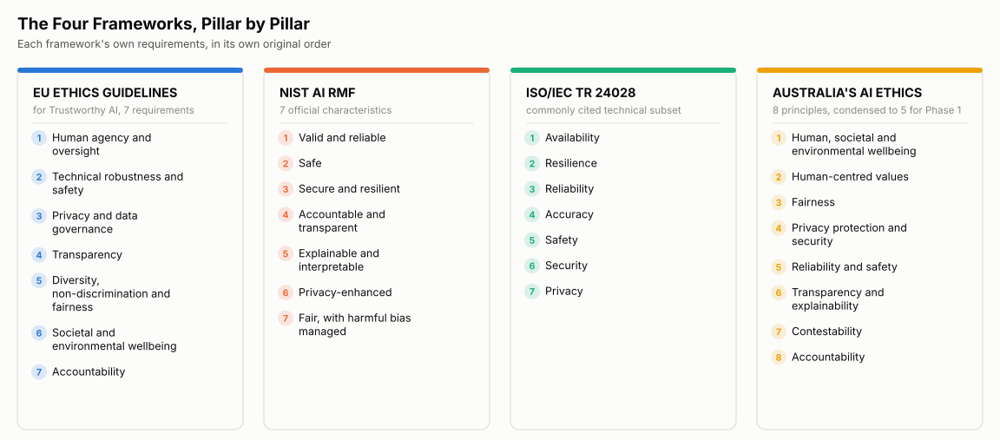

# Phase 2 Plan

**Phase 1** was proved  on one real production model, that testing against trustworthiness pillars produces genuinely useful evidence rather than an untested claim.  
**Phase 2** takes that proof of concept and turns it into a reusable schema which includes a manifest format, an adapter layer, and a canonical detection format, designed so the same governance-to-assurance evidence trail can be generated for any model submitted to it, regardless of architecture, and mapped directly to the standards that actually carry legal or certification weight (the EU AI Act, NIST AI RMF, and ISO/IEC SC42), rather than a simplified pillar set  
This document covers the standards landscape behind that decision, the resulting dimension structure, and the technical build plan.

## 1. The Standards Landscape

Multiple trustworthy AI frameworks exist because different bodies converged on the same concerns from different directions: ethics research, US risk management practice, and international standards work. None specify which tool to run, they stay abstract because the underlying concerns (opacity, brittleness, bias, drift) predate any specific testing tool. The pillars in each framework are the translation layer between that abstract language and concrete tests.

### 1.1 Four Trustworthy AI Frameworks

These four are frameworks for defining what trustworthy AI means, not governance frameworks (an organisation's own policies) and not assurance methods (test evidence). They're the vocabulary layer both of those draw from.

The report behind ISO/IEC TR 24028 also discusses accountability, transparency, explainability, and fairness elsewhere, these overlap with what the other frameworks already cover, which is why they're not repeated in this subset.

Phase 1 worked from a 5-pillar version of Australia's AI Ethics Principles. Phase 2 goes back to the EU, NIST, and ISO structures directly, rather than building on that condensed version, for the reasons below.

### 1.2 How the Pillars Line Up

| Theme | EU Ethics Guidelines | NIST AI RMF | ISO/IEC TR 24028 (subset) | Australia's AI Ethics Principles |
|---|---|---|---|---|
| Human oversight | Human agency and oversight | (gap) | (gap) | Human-centred values |
| Safety and reliability | Technical robustness and safety | Valid and reliable; Safe | Safety; Reliability; Accuracy | Reliability and safety |
| Security and resilience | (bundled into robustness) | Secure and resilient | Security; Resilience; Availability | (bundled into privacy and security) |
| Privacy and data governance | Privacy and data governance | Privacy-enhanced | Privacy | Privacy protection and security |
| Transparency and explainability | Transparency | Explainable and interpretable | (covered elsewhere in the report) | Transparency and explainability |
| Fairness and non-discrimination | Diversity, non-discrimination and fairness | Fair, with harmful bias managed | (covered elsewhere in the report) | Fairness |
| Accountability | Accountability | Accountable and transparent (bundled) | (covered elsewhere in the report) | Accountability |
| Societal and environmental wellbeing | Societal and environmental wellbeing | (gap) | (gap) | Human, societal and environmental wellbeing |
| Contestability | (gap) | (gap) | (gap) | Contestability |

The gaps and splits in this table, not the raw pillar counts, are what matter for Phase 2. Privacy and Societal Wellbeing barely register in some frameworks, and NIST treats things as separate that others bundle together. The condensed 5-pillar version Phase 1 used hides both.

### 1.3 Where These Come From

These aren't all the same kind of thing, a mix of the standards bodies, voluntary frameworks, and one binding regulation that the eight standards below draw from or sit alongside.

| Source | What it is | Why it matters here |
|---|---|---|
| ISO/IEC SC42 | Main international AI standards body, 45+ published standards | Source of ISO 24028, 24027, 24029, 5259, 42001, 5469, and TS 8200 |
| NIST AI RMF | US framework, voluntary, four functions: Govern, Map, Measure, Manage | Widely adopted structure for organising assurance evidence |
| EU AI Act | Binding EU law, separate from the EU Ethics Guidelines referenced in 1.1 | Bolt detection is plausibly high-risk, either an Annex III use case (deadline now 2 Dec 2027) or a product-embedded safety component (2 Aug 2028) |
| IEC 61508 | Traditional functional safety standard for industrial systems | Predates AI but still applies to the manufacturing context |
| IEEE 7000 | Process standard | Embeds ethical concerns into system design |

### 1.4 The Eight Standards to Know Deeply

Section 1.3 is context, who publishes what and why it exists. These eight are different ,each one is the specific standard that a dimension in the Phase 2 framework (Section 2) is tested and certified against. Knowing a standard's title isn't enough to defend an assurance claim against it, whoever runs that dimension's tests needs to be able to point to the specific clause the evidence satisfies. That's what turns a test result into evidence that carries legal or certification weight, rather than an internal claim.

| # | Standard | One line |
|---|---|---|
| 1 | ISO 24028 | Defines what trustworthiness in an AI system means at a technical level, the definitional anchor the rest of this framework builds on |
| 2 | ISO 24027 | What bias is and how to detect it, the Fairness pillar |
| 3 | ISO 24029 | How to test robustness, the Security/Robustness pillar |
| 4 | ISO 5259 series | Data quality requirements for AI, feeds the data assurance track |
| 5 | ISO 42001 | AI management system, the governance layer around everything |
| 6 | ISO 5469 | Functional safety plus AI, critical for manufacturing context |
| 7 | ISO/TS 8200 | Human oversight of AI, the gap in the current framework |
| 8 | NIST AI RMF | The US risk management framework, four functions: Govern, Map, Measure, Manage |

Section 2 shows exactly which of these maps to which dimension, and where the gaps still sit.
